# Huellitas — Sistema web para la gestión de adopciones de mascotas

**Huellitas** es una aplicación web desarrollada en Laravel para apoyar la gestión de adopciones de mascotas en un refugio o centro de adopción. El sistema permite publicar mascotas disponibles, registrar adoptantes, recibir solicitudes, revisar cada caso desde un panel administrativo, agendar citas, validar requisitos y formalizar la adopción mediante un certificado o acta.

---

## Descripción

El proyecto centraliza el proceso de adopción en una plataforma web con dos perfiles principales: el adoptante y el administrador. Desde la vista pública, una persona puede consultar el catálogo de mascotas, revisar información detallada de cada animal y enviar una solicitud de adopción. Desde el panel administrativo, el refugio puede administrar catálogos, revisar solicitudes, aprobar o rechazar postulaciones, programar citas, verificar requisitos y registrar la adopción final.

Huellitas busca ordenar el flujo operativo de un refugio, reducir el manejo manual de información y dejar trazabilidad del proceso desde la publicación de una mascota hasta la generación del acta de adopción.

---

## Contexto académico

Este proyecto fue desarrollado como entrega académica por dos integrantes y cumple con los criterios solicitados para una aplicación web con Laravel:

| Requisito | Implementación en Huellitas |
| --- | --- |
| Aplicación Laravel | Estructura MVC con rutas, controladores, modelos Eloquent, migraciones y seeders. |
| Vistas con Bootstrap | Interfaces Blade con Bootstrap 5 y estilos propios para la vista pública, autenticación y panel administrativo. |
| Repositorio Git | Proyecto versionado en Git y publicado en GitHub. |
| Ramas por integrante/característica | Trabajo dividido en `branch-jd` y `branch-kg`. |
| Modelo relacional coherente | Base de datos organizada en 12 tablas principales relacionadas con el flujo de adopción. |
| Modelos relacionados | Modelos Eloquent con relaciones entre usuarios, mascotas, solicitudes, citas, requisitos y adopciones. |
| Autenticación | Inicio de sesión, registro, cierre de sesión y control de acceso por rol. |
| Navegación entre páginas | Flujo navegable entre inicio, catálogo, detalle, solicitudes del adoptante y módulos administrativos. |

---

## Distribución del trabajo

| Rama | Parte | Alcance principal |
| --- | --- | --- |
| `branch-jd` | Parte 1 | Base del sistema, modelo relacional, seguridad, roles, panel administrador y CRUD base. |
| `branch-kg` | Parte 2 | Vista pública, catálogo, solicitudes, citas, requisitos, adopciones y certificado/acta. |

---

## Flujo general del sistema

1. El refugio registra una mascota y la marca como disponible.
2. El adoptante inicia sesión en el sistema.
3. El adoptante revisa el catálogo y envía una solicitud de adopción.
4. El administrador revisa la solicitud desde el panel administrativo.
5. El administrador aprueba y agenda una cita, o rechaza la solicitud con una respuesta.
6. El administrador verifica los requisitos asociados al proceso de adopción.
7. El administrador registra la adopción final cuando el proceso se completa.
8. El sistema muestra el certificado o acta de adopción correspondiente.

---

## Roles del sistema

| Rol | Descripción |
| --- | --- |
| Administrador | Gestiona catálogos, mascotas, requisitos, solicitudes, citas, verificaciones y adopciones. Tiene acceso al panel administrativo. |
| Adoptante | Consulta la vista pública, se registra, inicia sesión, solicita adoptar una mascota y revisa el estado de sus solicitudes o adopciones. |

---

## Funcionalidades principales

* Login, registro y cierre de sesión.
* Panel administrador con indicadores y gráficas.
* Gestión de tipos de mascotas.
* Gestión de razas por tipo de mascota.
* Gestión de mascotas y sus datos principales.
* Gestión de requisitos de adopción.
* Catálogo público de mascotas disponibles.
* Vista de detalle de mascota.
* Envío de solicitudes de adopción.
* Aprobación o rechazo de solicitudes.
* Agenda y seguimiento de citas.
* Verificación de requisitos por solicitud.
* Registro de adopciones finalizadas.
* Visualización y descarga del certificado o acta de adopción.

---

## Modelo relacional

El sistema trabaja con 12 tablas principales para representar el proceso de adopción:

| Tabla | Propósito |
| --- | --- |
| `roles` | Define los perfiles de acceso del sistema, como administrador y adoptante. |
| `users` | Almacena los datos de los usuarios, credenciales, información personal y rol asignado. |
| `tipos_mascotas` | Registra categorías generales de mascotas, por ejemplo perro, gato, ave u otros tipos. |
| `razas` | Registra razas asociadas a un tipo de mascota. |
| `mascotas` | Almacena la información principal de cada mascota: nombre, raza, edad, género, tamaño, descripción y estado. |
| `imagenes_mascotas` | Guarda las rutas de imágenes asociadas a las mascotas y permite identificar una imagen principal. |
| `solicitudes_adopcion` | Registra las solicitudes enviadas por adoptantes para una mascota específica. |
| `respuestas_solicitud` | Guarda la respuesta administrativa de una solicitud, indicando si fue aprobada o rechazada. |
| `citas_adopcion` | Registra citas asociadas a solicitudes aprobadas, incluyendo fecha, hora, lugar, indicaciones y estado. |
| `requisitos_adopcion` | Define los requisitos que deben cumplirse para adoptar, asociados a tipos de mascota. |
| `cumplimientos_requisitos` | Registra la revisión de cada requisito dentro de una solicitud de adopción. |
| `adopciones` | Formaliza la adopción final, vinculando la solicitud aprobada con fecha, número de acta y observaciones. |

---

## Stack tecnológico

| Componente | Tecnología usada |
| --- | --- |
| Framework backend | Laravel 13 |
| Lenguaje backend | PHP 8.3 |
| Plantillas | Blade |
| Interfaz | Bootstrap 5, Bootstrap Icons y CSS propio |
| Base de datos | MariaDB/MySQL |
| ORM | Eloquent |
| Dependencias PHP | Composer |
| Assets frontend | NPM y Vite |
| Control de versiones | Git y GitHub |

---

## Estructura del repositorio

```text
proyecto-ldp-huellitas/
├── app/                    # Modelos, controladores, middleware y lógica principal de Laravel
├── database/
│   ├── migrations/         # Definición del esquema relacional
│   └── seeders/            # Datos iniciales y usuarios de demostración
├── resources/
│   └── views/              # Vistas Blade públicas, de autenticación y administración
├── routes/                 # Definición de rutas web
├── public/                 # Punto de entrada, CSS público e imágenes usadas por la aplicación
├── capturas/               # Imágenes usadas como evidencia visual del sistema
├── docs/                   # Documentación complementaria en PDF
├── composer.json           # Dependencias y scripts PHP/Laravel
├── package.json            # Dependencias y scripts NPM/Vite
└── README.md               # Documentación principal del proyecto
```

---

## Capturas del sistema

Las siguientes capturas se encuentran en la carpeta `capturas/`. El orden y la descripción se organizaron usando como referencia el archivo `docs/Capturas - Huellitas.pdf` y los nombres reales de los archivos disponibles.

### Portada

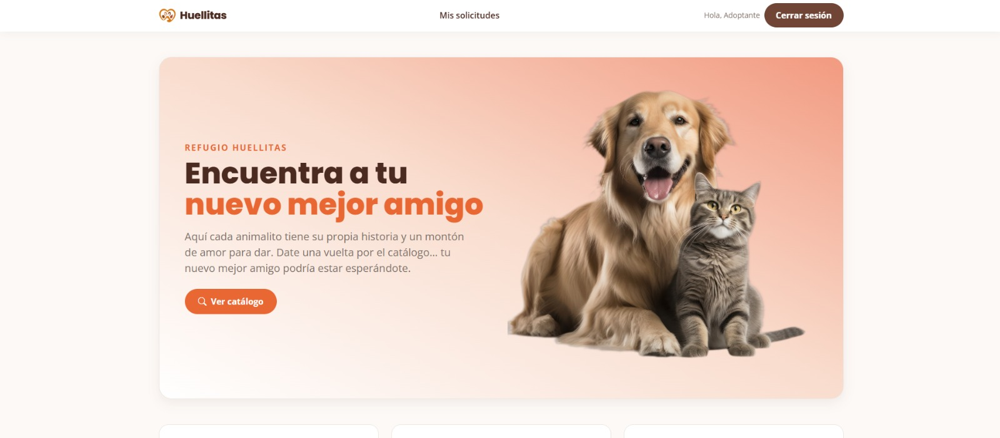

La pantalla principal presenta la identidad visual de Huellitas y dirige al usuario hacia el catálogo de mascotas disponibles.

### Vista pública

Esta sección muestra la navegación inicial del adoptante antes de enviar una solicitud: explicación del proceso, mascotas destacadas y catálogo público.

| Proceso de adopción | Mascotas con menor edad |
| --- | --- |
| 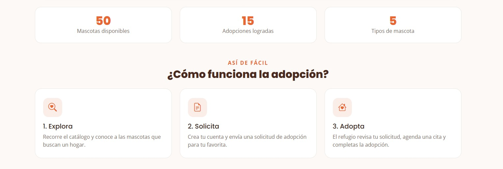 | 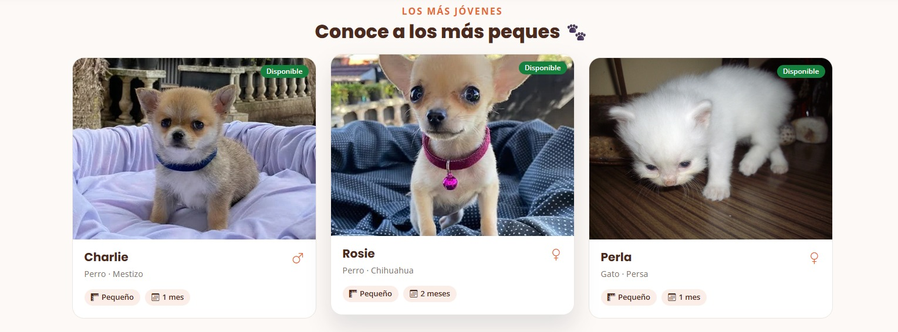 |
| Explica los pasos generales para explorar, solicitar y completar una adopción. | Presenta mascotas destacadas por edad dentro de la vista pública. |

| Sección pública de mascotas | Catálogo de mascotas |
| --- | --- |
| 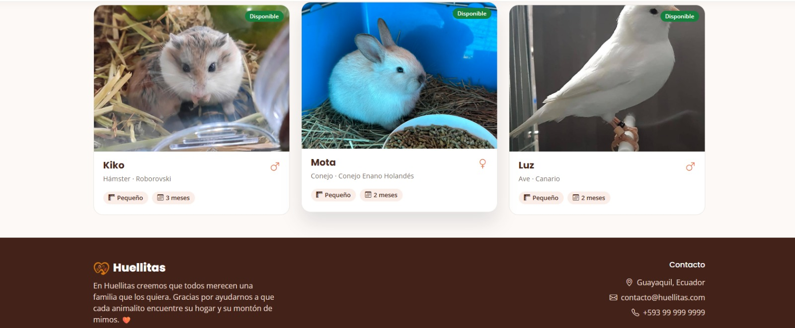 | 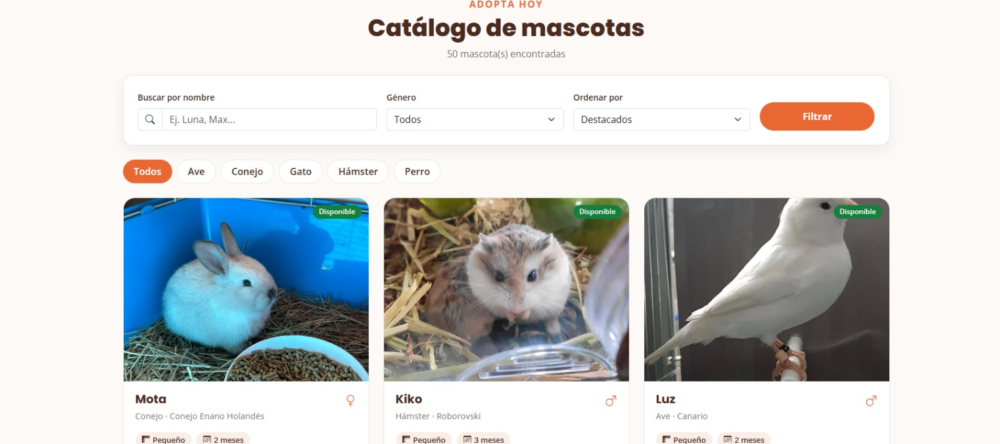 |
| Muestra tarjetas de mascotas disponibles con acceso a su detalle. | Permite filtrar o revisar mascotas disponibles para adopción. |

### Catálogo, detalle y solicitud

Estas capturas evidencian el flujo que sigue el adoptante al elegir una mascota, revisar sus requisitos y enviar una solicitud.

| Detalle de mascota | Formulario de solicitud |
| --- | --- |
| 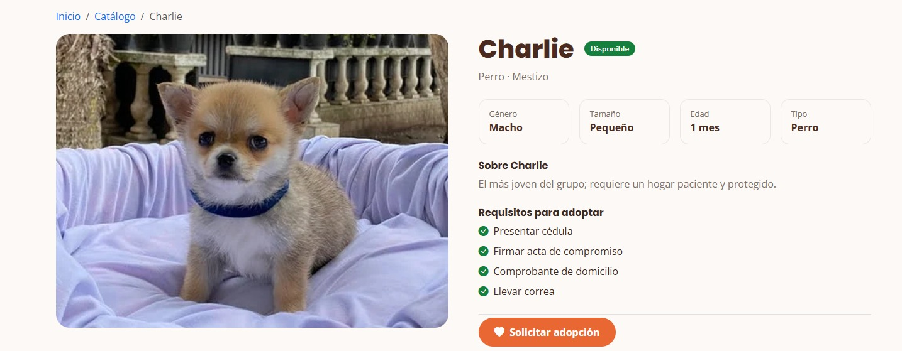 | 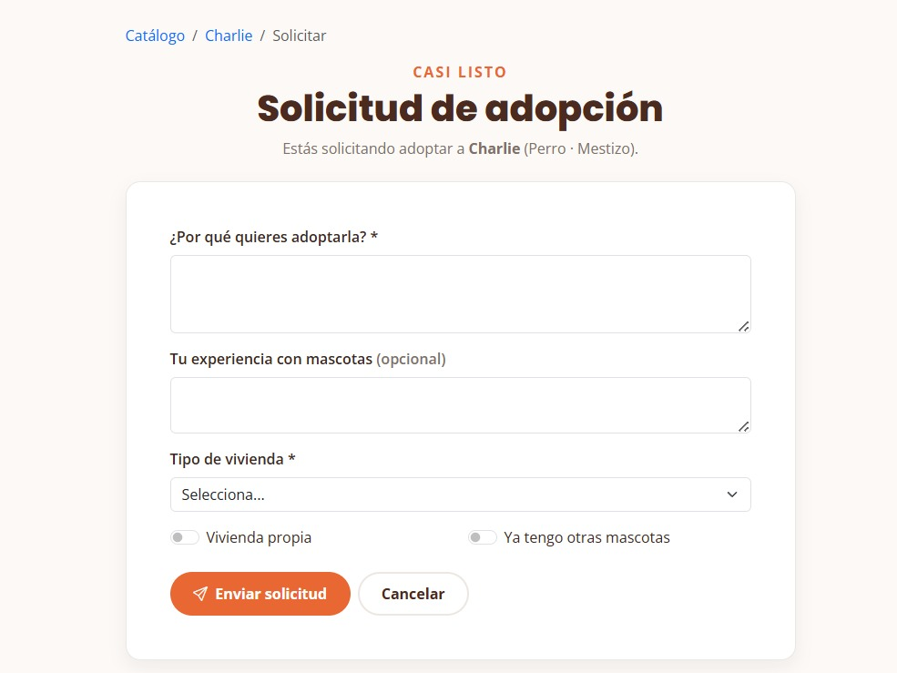 |
| Presenta datos de la mascota, requisitos aplicables y acción para solicitar la adopción. | Recoge la motivación, experiencia y condiciones de vivienda del adoptante. |

| Solicitud en proceso | Solicitud aprobada |
| --- | --- |
| 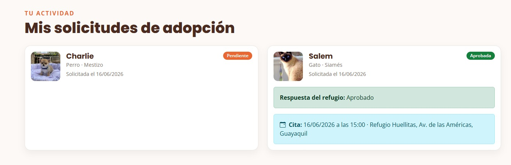 | 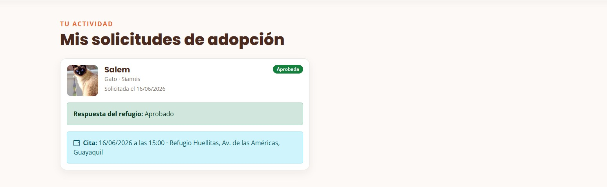 |
| Muestra una solicitud enviada con estado pendiente o en revisión. | Muestra al adoptante una solicitud aprobada con información de la cita. |

### Autenticación y registro

| Registro de adoptante | Solicitud rechazada vista por adoptante |
| --- | --- |
| 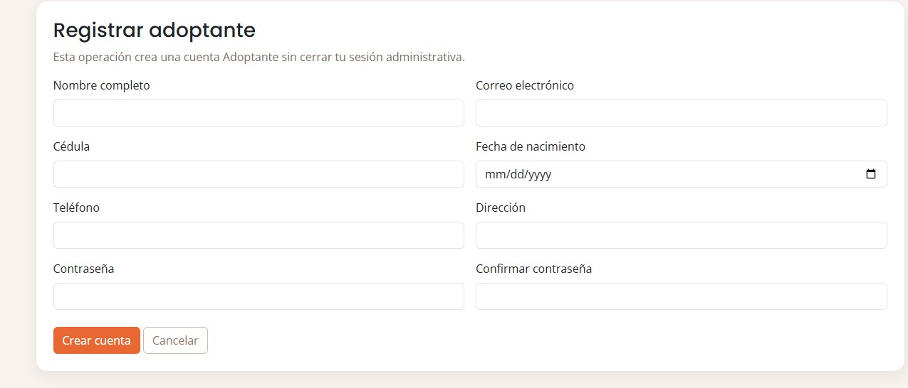 | 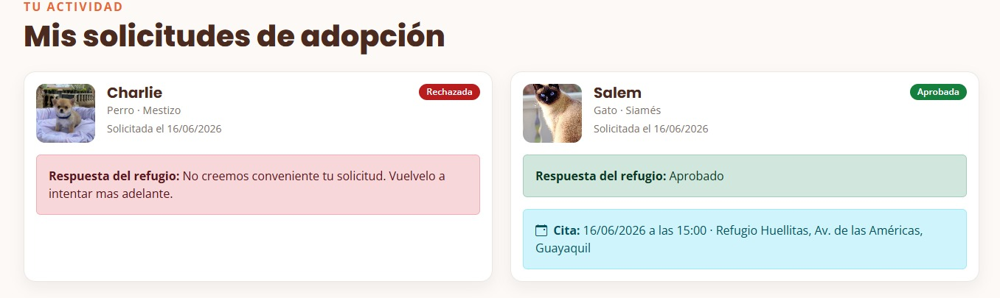 |
| Permite crear una cuenta de adoptante sin intervención administrativa. | Muestra la respuesta cuando una solicitud fue rechazada. |

### Panel administrador

El panel administrativo resume el estado del refugio y permite acceder a los módulos de gestión.

| Dashboard administrativo | Indicadores y gráficas |
| --- | --- |
| 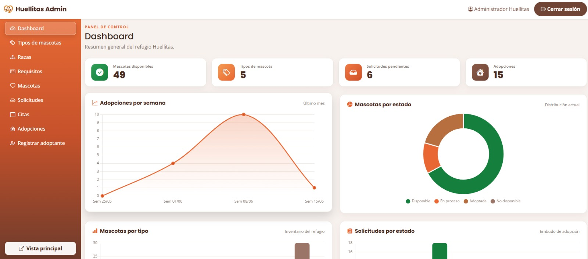 | 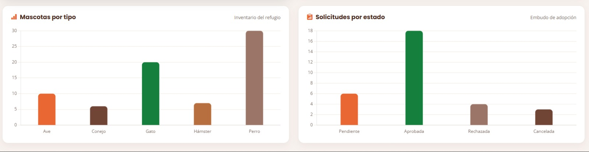 |
| Presenta métricas generales sobre mascotas, solicitudes, adopciones y tipos de mascota. | Muestra reportes visuales por tipo de mascota y estado de solicitudes. |

### Catálogos administrativos

Estas pantallas corresponden a los CRUD base usados por el administrador para mantener la información del sistema.

| Tipos de mascotas | Razas por tipo de mascota |
| --- | --- |
| 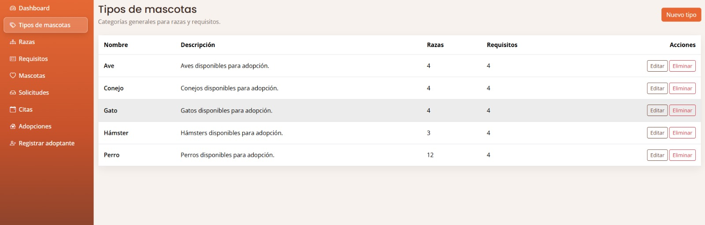 | 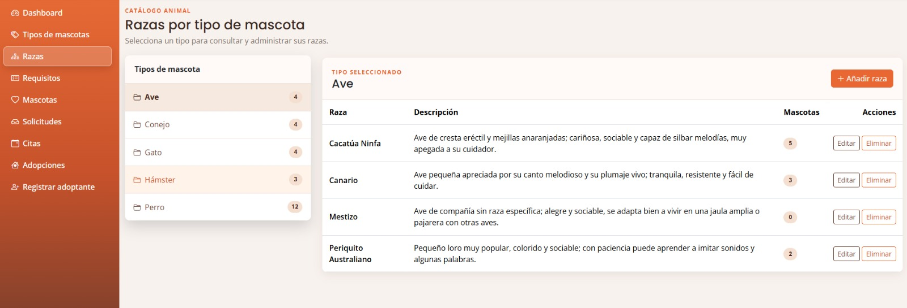 |
| Permite administrar las categorías generales de mascotas. | Permite registrar y consultar razas asociadas a cada tipo de mascota. |

| Requisitos de adopción | Gestión de mascotas |
| --- | --- |
| 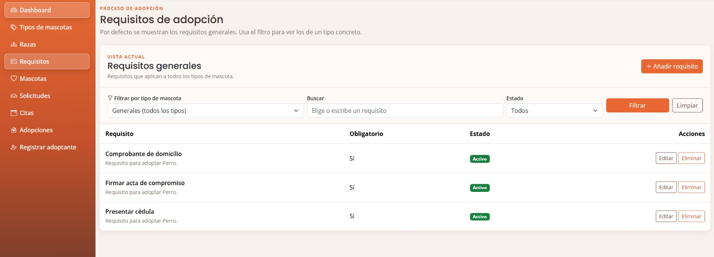 | 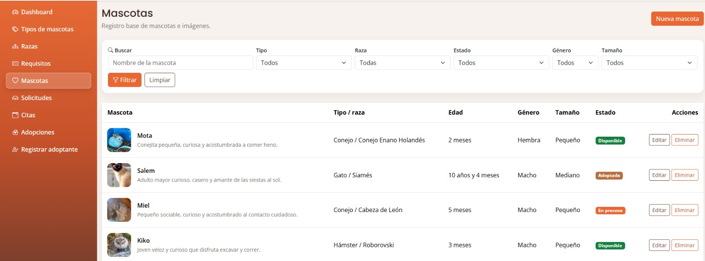 |
| Administra requisitos generales y obligatorios para el proceso de adopción. | Lista las mascotas registradas con filtros y acciones administrativas. |

### Solicitudes de adopción

El administrador puede revisar solicitudes, responderlas y cambiar su estado según la evaluación del caso.

| Listado de solicitudes | Revisión de solicitud |
| --- | --- |
| 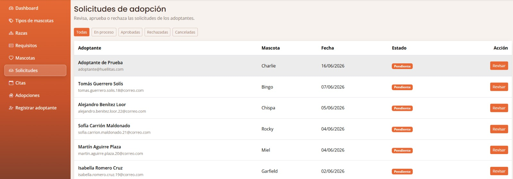 | 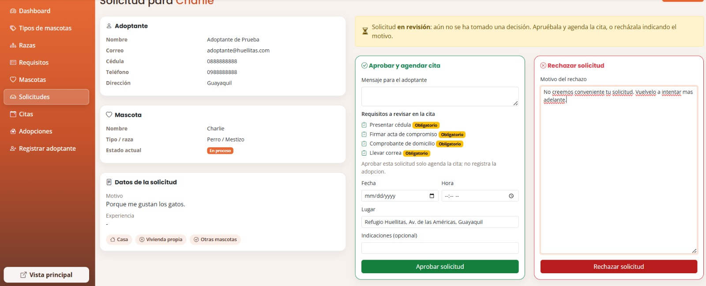 |
| Muestra solicitudes recibidas, adoptante, mascota, fecha, estado y acciones. | Presenta el detalle de la solicitud y las opciones de aprobación o rechazo. |

| Solicitud rechazada | Solicitud aprobada |
| --- | --- |
| 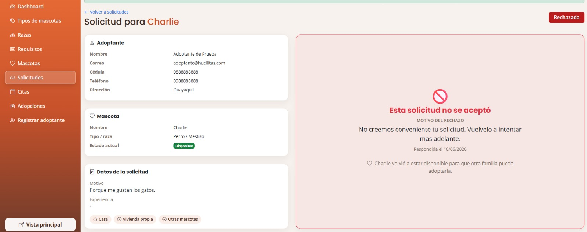 | 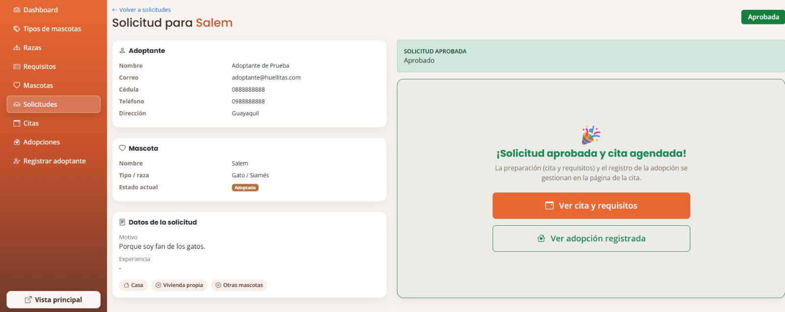 |
| Evidencia el registro de una solicitud negada con su respuesta administrativa. | Evidencia una solicitud aprobada y el paso posterior para ver o agendar requisitos. |

### Citas y verificación de requisitos

Después de aprobar una solicitud, el sistema permite programar una cita y revisar el cumplimiento de requisitos.

| Agenda de citas | Cita con requisitos pendientes |
| --- | --- |
| 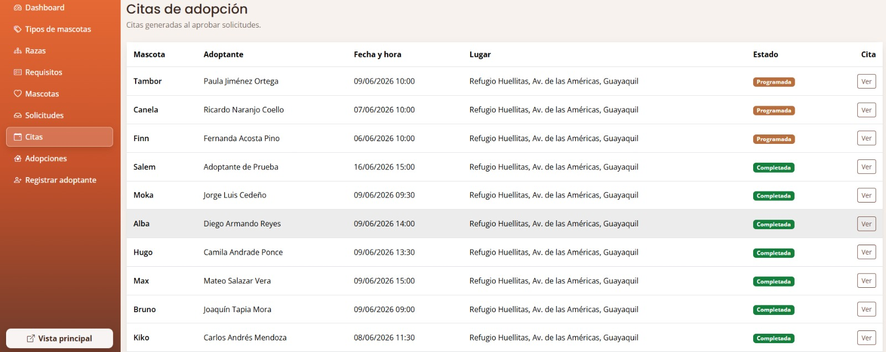 | 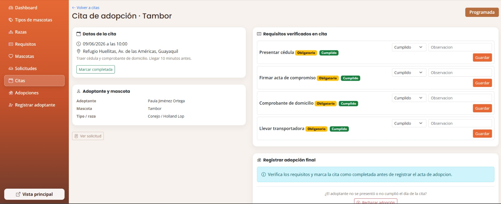 |
| Lista citas de adopción con adoptante, mascota, fecha, lugar y estado. | Permite revisar y actualizar requisitos asociados a una cita específica. |

| Cita completada y adopción registrada |
| --- |
| 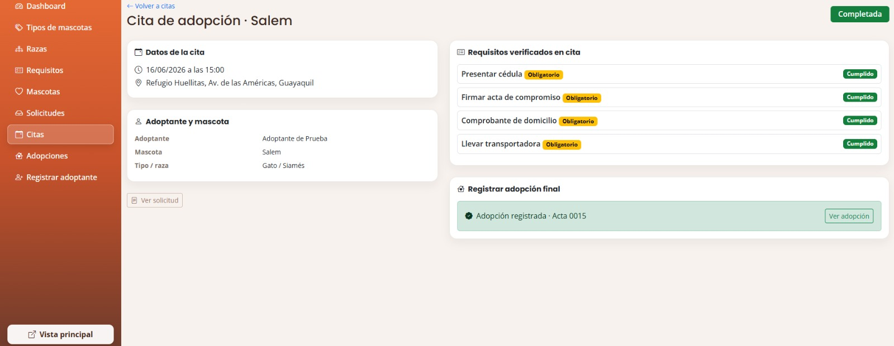 |
| Muestra el cierre del proceso cuando los requisitos han sido aprobados y la adopción puede registrarse. |

### Adopciones y certificado

El cierre del flujo genera un certificado o acta como constancia formal de la adopción.

| Certificado de adopción | Descarga o impresión en PDF |
| --- | --- |
| 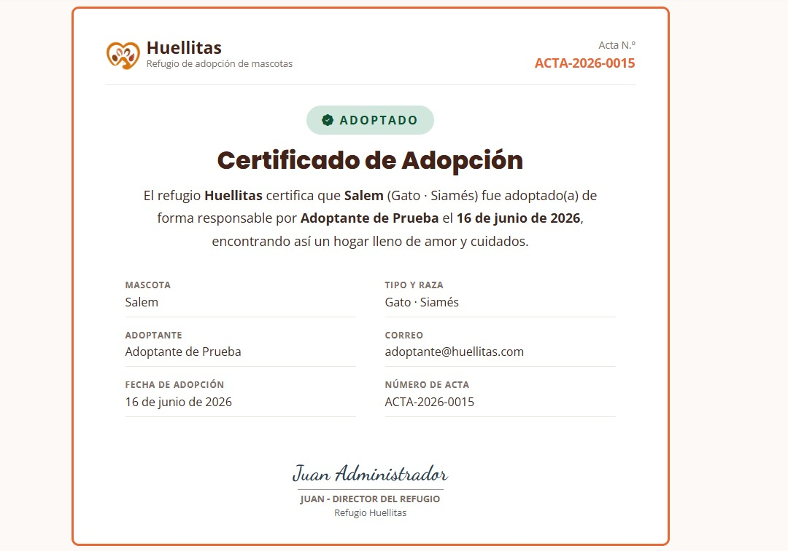 | 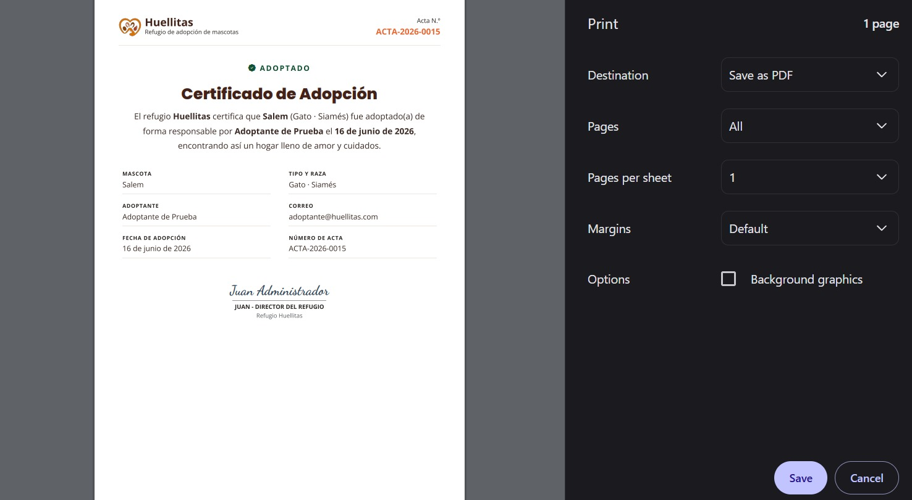 |
| Presenta el acta con datos del refugio, adoptante, mascota, fecha y número de acta. | Permite guardar o imprimir el certificado desde el navegador. |

---

## Instalación y ejecución

Comandos sugeridos para Linux/CachyOS:

```bash
# Clonar el repositorio
git clone https://github.com/jdsotomayorjimenez/proyecto-ldp-huellitas.git
cd proyecto-ldp-huellitas

# Instalar dependencias PHP
composer install

# Instalar dependencias frontend
npm install

# Crear archivo de entorno
cp .env.example .env

# Generar clave de aplicación
php artisan key:generate
```

Configura la base de datos en `.env` con una base llamada `huellitas_db`:

```env
DB_CONNECTION=mysql
DB_HOST=127.0.0.1
DB_PORT=3306
DB_DATABASE=huellitas_db
DB_USERNAME=tu_usuario
DB_PASSWORD=tu_contrasena
```

Luego ejecuta migraciones, seeders y servidores de desarrollo:

```bash
# Crear tablas y cargar datos iniciales
php artisan migrate:fresh --seed

# Ejecutar servidor Laravel
php artisan serve

# En otra terminal, ejecutar Vite si se requiere compilar assets en desarrollo
npm run dev
```

La aplicación quedará disponible normalmente en `http://127.0.0.1:8000`.

---

## Credenciales de demostración

Las credenciales se encuentran definidas en `database/seeders/UserSeeder.php`.

| Rol | Correo | Contraseña |
| --- | --- | --- |
| Administrador | `admin@huellitas.com` | `password` |
| Adoptante | `adoptante@huellitas.com` | `password` |

---

## Verificación del flujo

Para probar el proceso principal de adopción:

1. Iniciar sesión como adoptante.
2. Ver el catálogo público de mascotas.
3. Seleccionar una mascota y enviar una solicitud de adopción.
4. Cerrar sesión.
5. Iniciar sesión como administrador.
6. Revisar la solicitud recibida.
7. Aprobar la solicitud y agendar una cita.
8. Verificar los requisitos de adopción.
9. Registrar la adopción cuando los requisitos estén aprobados.
10. Ver el certificado o acta de adopción.

---

## Estado del proyecto

El proyecto cuenta con una implementación funcional del flujo académico solicitado: autenticación, roles, panel administrador, catálogos base, vista pública, catálogo de mascotas, solicitudes, respuestas administrativas, citas, verificación de requisitos, adopciones y certificado.

Como mejoras futuras podrían considerarse la carga avanzada de imágenes desde el panel, notificaciones automáticas por correo, historial más detallado de cambios de estado, pruebas automatizadas adicionales y mejoras de accesibilidad en las vistas.

---

## Autores

Proyecto desarrollado por:

* Juan Diego Sotomayor
* Karel González
